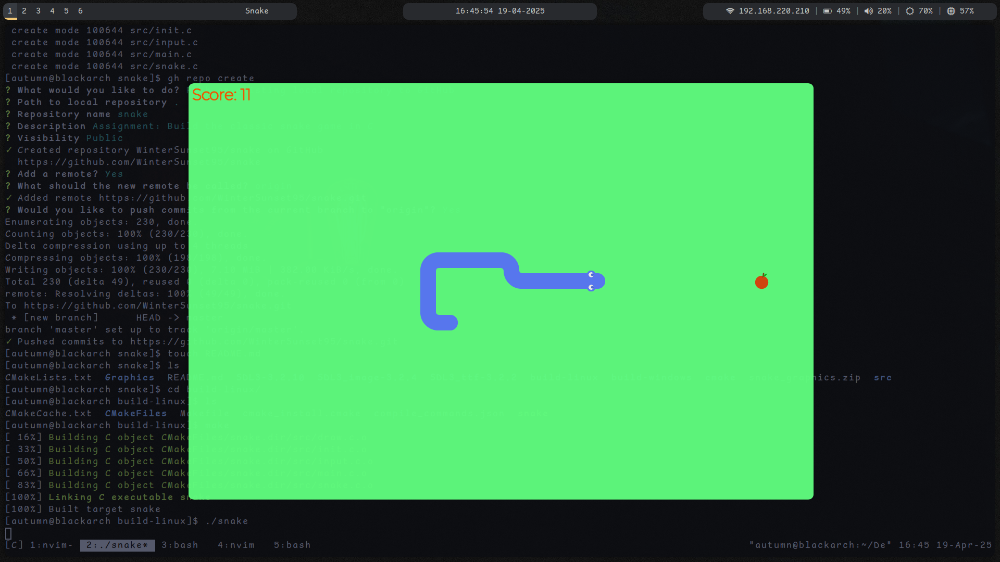

# Novanectar Internship Assignment 1
## Classic Snake Game In C
Downloads are available for linux and windows at the [releases page.](https://github.com/WinterSunset95/snake/releases)

## Preview



https://github.com/user-attachments/assets/905bb4fa-482a-43d4-a8c8-456da0fa7c92

## Overview
This Snake game is a classic arcade-style game developed in C using the SDL3 library for GUI. The project was undertaken as a
learning exercise to solidify the understanding of:
- Game loop architecture
- Real-time input handling
- Code organisation in C
- Efficient Asset Management
The development was done with a focus on clean code structure, seperation of concerns and concepts like Single Source of Truth.

## Duration taken to complete the project
Development of the initial version took approximately 48 hours, including but not limited to research, architecture design and studying SDL3 documentation.

## Outcome
The final outcome is a functional, snake game that runs on both linux and windows. Written below are the features:
- Clean and modular architecture, seperating concerns into "input", "render", "game", "snake", "apple" and "state" modules.
- Two game screens "Play" and "Game Over".
- Grid-based movement with accurate directional rendering.
- Random food generation with collision avoidance.
- Snake growth and score tracking.
- SDL3-based rendering using loaded textures for performance.
- Clean build system using CMake, supporting both Linux (GCC) and Windows (MinGW).
- Structured asset management using a centralized Assets struct.

## Challenges Faced
While the game architecture is straightforward, a number of deeper developmental challenges were faced:
- State Management:
Managing multiple game screens (Play, Game Over) proved tricky initially. This was resolved by using a global "Game" state and isolating
each state's logic into seperate "render" or "update" functions.
- Texture Management:
Inefficiencies were faced involving how assets were loaded and used. This was resolved by loading all assets once during game initialization
and storing them in a centralized Assets struct inside "Game" state.
- Snake body management:
Tracking the entire snake body turned out to be a tricky design challenge. A breakthrough came with the decision to use an array of "Cell" structs
where each "Cell" holds the x and y coordinates of a segment. This allowed the snake to be traversed in a clean and predictable manner.
This approach also made collision detection, rendering and growth logic significantly easier to manage.
```c
typedef struct {
    int x;
    int y;
} Cell;
Cell snake[GRID_SIZE];
```
- Snake movement logic:
After the design decision above, movement logic became much more simple.
By iterating from tail to head, each segment would adopt the position of the segment before it, resulting in smooth and accurate movement behaviour.
```c
// Move body (from tail to head)
for (int i=length-1; i>0; i--) {
    snake[i].x = snake[i-1].x;
    snake[i].y = snake[i-1].y;
}
```
And then updating the head based on the current direction.
```c
// Move head
if (direction == UP)    snake[0].y--;
if (direction == DOWN)  snake[0].y++;
if (direction == LEFT)  snake[0].x--;
if (direction == RIGHT) snake[0].x++;
```
- Directional rendering logic:
Drawing the correct sprite for each segment was one of the more logic-heavy parts. It required analyzing the previous and next cell of each body
segment to determine its role (straight, corner etc.) and orientation. This was handled with clean comparisions of curr, prev and next x/y values
to conditionally assign the appropiate texture.

## Conclusion
The Snake Game Project was a good practical exercise in low-level C and graphics programming. It demonstrated how a classic arcade game can be 
structured using modern C standards, separation of concerns, and robust build tooling. The final result is a fun game with a clean, modular
codebase that is easy to extend - whether for adding audio, AI, levels, or even multiplayer.
The project reinforced key software engineering concepts including:
- Modular design
- Resource management
- Event-driven input
- State-driven rendering
- Build system management
- Cross-platform development
